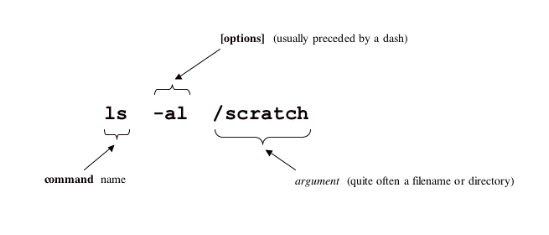

## Why command line?

- core skill
- simple
- powerful
- lasting
- universal
- hackable
- fun

## Bash

> Bash is the GNU Project's shell. Bash is the Bourne Again SHell. Bash is an
sh-compatible shell that incorporates useful features from the Korn shell (ksh)
and C shell (csh). It is intended to conform to the IEEE POSIX P1003.2/ISO
9945.2 Shell and Tools standard. It offers functional improvements over sh for
both programming and interactive use. In addition, most sh scripts can be run
by Bash without modification.<sup>1</sup>

1. http://www.gnu.org/software/bash/

## Table of contnets

- [Level 1: Finidng your way](https://github.com/denten/dhnotes/blob/master/cli-basics.md#level-1-finding-your-way)
- [Level 2: Files and folders](https://github.com/denten/dhnotes/blob/master/cli-basics.md#level-2-files-and-folders)
## Level 1: Finding your way

```
ls
ls -l
pwd
man man (q to exit)
mkdir test/
cd test
cd ..
cd ~
cd /
history
```

### Notes

Tab complete everything. Do not advance until you understand the difference
between relative and absolute paths.

### Explore

[Filesystem Hierarchy Standard](http://www.pathname.com/fhs/)

### Bonus

`pushd`, `popd`, `cd -`

## Level 2: Files and folders

```
man man
mkdir
touch filename
cp oldpath/oldfile newpath/newfile
mv oldpath/file newpath/file
rm -i path/filname
rm -r foldername
cat filename
head filename
tail filename
```



> *Figure 1*: Anatomy of a UNIX Command. Via [Texas A&M High Performance Research Computing](http://web.archive.org/web/20150529023907/http://sc.tamu.edu/help/general/unix/unix.html)

### Notes

Think of the syntax as "verb, adverb, object noun". Man everything. Rename with
mv. Open your graphical file manager and follow along as you move / create /
delete files. `cat` a `.pdf` file, `.docx`, and `.txt`.

### Explore

[Take the Linux Filesystem Tour](http://web.archive.org/web/20140224004333/http://tuxradar.com/content/take-linux-filesystem-tour#null)

### Bonus

`ctr+shift+R [start typing one of the commands you used above]`, repeat to
cycle through


## Level 3: Permissions


> *Figure 1*: Anatomy of a UNIX Command. Via [Texas A&M High Performance Research Computing](http://web.archive.org/web/20150529023907/http://sc.tamu.edu/help/general/unix/unix.html)

```
cd /
touch test.txt
sudo !!
cd -
touch test.txt
chomd u-w test.txt
nano test.txt
```
### Notes

## Level 4: Streams, pipes, and redirects

```
cat filename | less
man less
man more
```

## Level 5: Search

up and down to cycle through history, `history`, pipes!, `history | less`,
`history | grep "test.txt"`, `nano`, `cat`

Bonus: `ctrl-r`, repeat to cycle

`grep`, `find`, `awk`

Note the complimentary use of `-print0` and `-0` to handle white spaces in file names.
`find -name "*.pdf" -print0 | xargs -0 lpr`

## Level 6: Text manipulation

## Resources

- [commandlinefu.com](http://www.commandlinefu.com)
